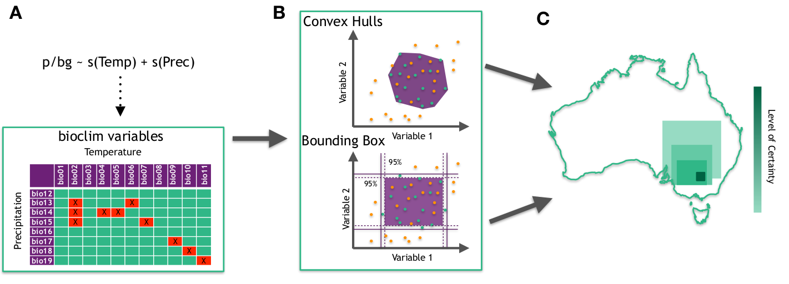

<!-- README.md is generated from README.Rmd. Please edit that file -->

```{r, include = FALSE}
knitr::opts_chunk$set(
  collapse = TRUE,
  comment = "#>",
  fig.path = "man/figures/README-",
  out.width = "100%"
)
```

# che

<!-- badges: start -->
<!-- badges: end -->

Convex Hull Ensembles for Species Distribution Modelling

## Installation

You can install the development version from [GitHub](https://github.com/) with:

``` r
# install.packages("devtools")
devtools::install_github("mattecologist/che")
```

Note: this current version has mixed performance on different systems. I've only been testing it on linux systems so far, and on 4-core and 12-core processors. The later gives much more stable performance.

## Background

Species distribution models (SDMs) have become increasingly popular to predict the potential geographic range of invasive species, by correlating the known distribution of a species with environmental variables, and transferring these relationships into novel environments and geographic space. The SDM literature has largely focused on improving the statistical fit of models when projecting into novel geographic space. Specifically, by understanding how background size and extent may influence model transferability, and how best to select absence, pseudo-absence or background points for modelling. These investigations are coupled with considerable examination of how model evaluation methods and test scores are influenced by these choices. An area that remains challenging and under-discussed is methods to choose predictive variables that will result in models that transfer between regions. This is challenging as non-causal variables may still show significant associations with distributions.

Here we introduce methods to finesse this problem by using multiple simple models to search for the most appropriate variables from a given set, and then apply them as two variable envelopes in an ensemble approach. This is in the 
`che` function of this package. We also include modified approaches using `bioclim` variables and `range bagging`.


Schematic of new ensemble modelling technique.
A
. Variable pairs of temperature and
precipitation  using  the  bioclim  variable  are  used  in  simple  GAMs  and  then  assessed  for  relative
model fit using AUC (and other metrics, see text).  Green squares are the pairs kept, red squares with
crosses are omitted.
B
. The variable pairs selected are used to create two-dimensional environmental
envelopes capturing all the presence points (green points) inside all available environments (green
+ orange points), using a minimum convex polygon (convex hulls (CHE)), or by use of bounding
boxes defined through the BIOCLIM algorithm (BBE).
C
. Each of the two-variable envelopes from
B are projected to a new geographical surface (as a gridded raster) and then stacked (summed.  The
results are then averaged, and the resulting surface is a continuous scale from 0-1 reflecting the level
of certainty (closer to 1) that a given raster cell falls in the environmental limits across the given
predictor variables.

## Example

There will soon be a vignette demonstrating use of this package


